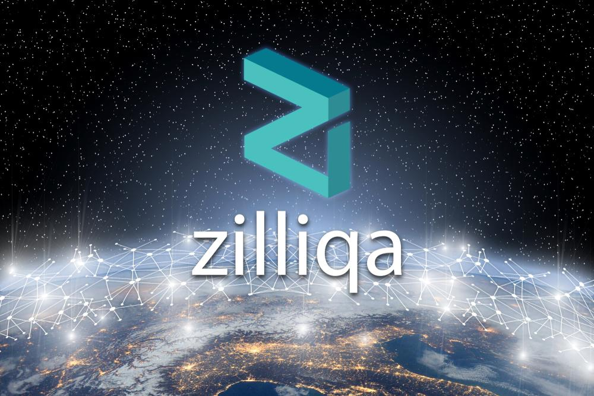

# Zilliqa-Dapp

This is a Web application to view our Hello World smart contract. Using zilliqa-js to invoke the setHello and getHello transitions that we have created in our Hello World smart contract.

## Use a web application to view your Hello World smart contract
## Link any web application with ZilPay
## Make transition calls to your Scilla smart contract on a web application with zilliqa-js
## Create our very own Hello World web application

Retrieve the transaction ID of contract calls made with zilliqa-js and view them on a block explorer

This is a simple web application that allows us to call the setHello and getHello transitions in our Hello World smart contract. We can connect our ZilPay wallet to the web application by clicking the “Connect Zilpay” button. 

Once the ZilPay wallet is connected, we can proceed to submit our contract address. This contract address is the one that is generated when we deployed our Hello World smart contract onto the Zilliqa testnet. This tells the web application which contract to make the transition calls to.
